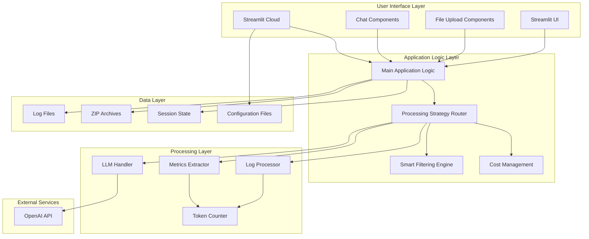
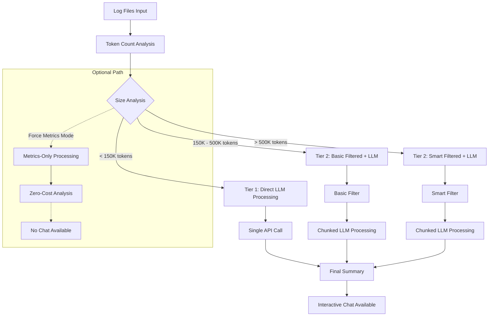
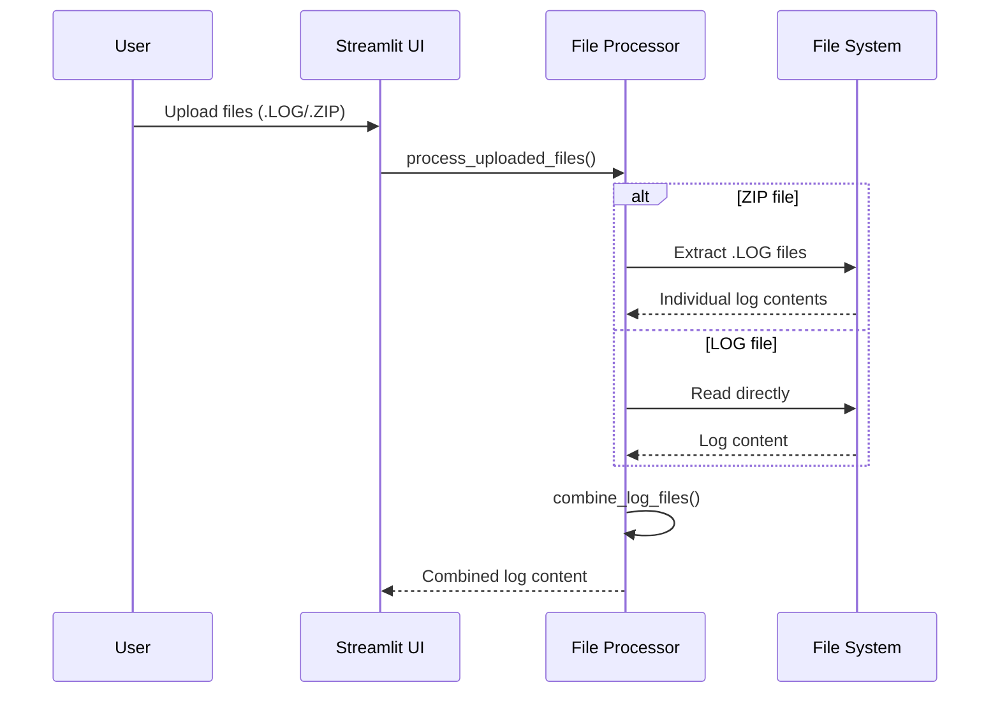
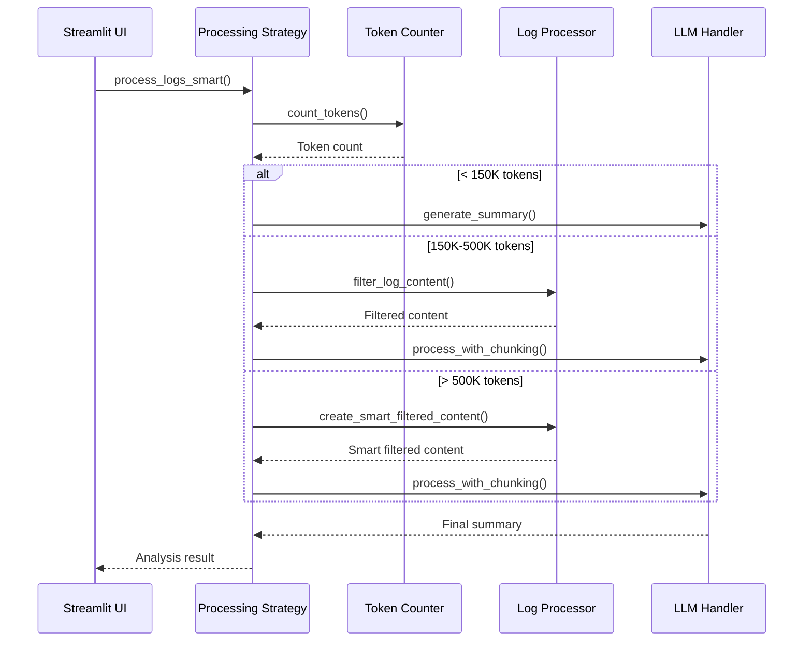
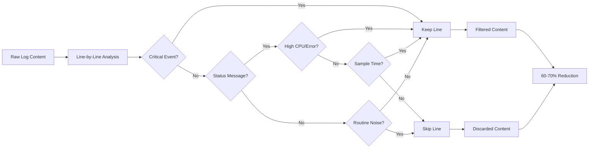
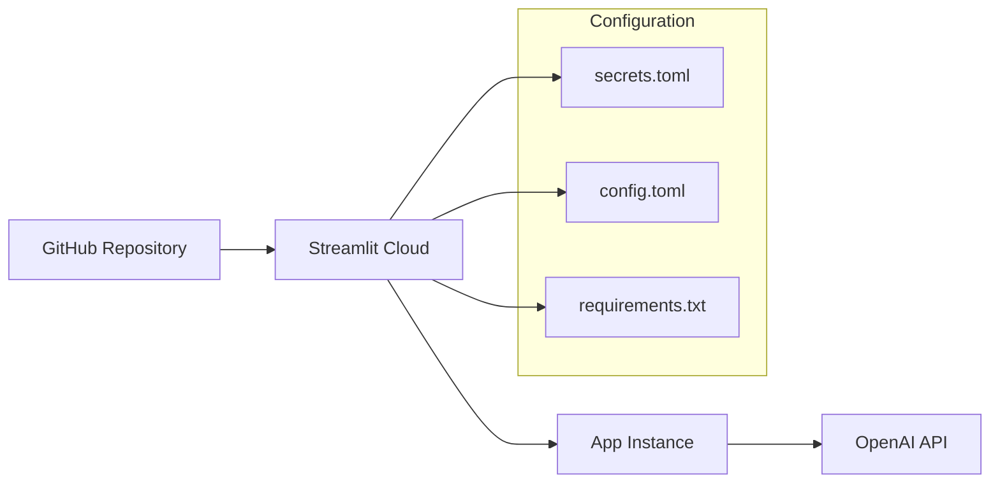

# 🏗️ LogFileAnalyzerV2 - Design Document

## Table of Contents
1. [Overview](#overview)
2. [System Architecture](#system-architecture)
3. [Core Components](#core-components)
4. [Processing Strategy](#processing-strategy)
5. [Data Flow](#data-flow)
6. [Technical Implementation](#technical-implementation)
7. [API Integration](#api-integration)
8. [User Interface Design](#user-interface-design)
9. [Security & Configuration](#security--configuration)
10. [Deployment Architecture](#deployment-architecture)
11. [Performance & Optimization](#performance--optimization)
12. [Error Handling](#error-handling)
13. [Extensibility](#extensibility)
14. [Testing Strategy](#testing-strategy)

## Overview

### Purpose
LogFileAnalyzerV2 is a Streamlit-based web application designed to analyze diagnostic and runtime logs from IPETRONIK's IPEmotionRT system. It leverages advanced GPT models (GPT-4.1 and GPT-5) to provide intelligent log analysis with cost-optimized processing strategies.

### Key Features
- 🚀 **Two-Tier Processing Strategy** with smart filtering
- 📊 **Multi-file support** (.LOG files and .ZIP archives)  
- 🤖 **Dual model support** (GPT-4.1 and GPT-5)
- ⚡ **Optional metrics-only mode** for zero-cost analysis
- 💬 **Interactive chat** for follow-up questions
- 💰 **Real-time cost tracking**

### Target Users
- **Log Analysts**: Engineers analyzing IPE logger diagnostics
- **DevOps Engineers**: Monitoring system health and performance
- **Support Teams**: Troubleshooting customer issues
- **Developers**: Understanding system behavior through logs

## System Architecture



### Architecture Principles

1. **Modular Design**: Clear separation of concerns across modules
2. **Scalable Processing**: Intelligent tier selection based on file size
3. **Cost Optimization**: Multiple processing strategies to minimize API costs
4. **User Experience**: Real-time feedback and progress tracking
5. **Security First**: Secure API key management and data handling

## Core Components

### 1. Main Application (`st_loganalyzer_v3.py`)
**Purpose**: Streamlit UI orchestration and user interaction management

**Key Responsibilities**:
- UI layout and component management
- File upload handling
- Processing strategy coordination
- Session state management
- Real-time progress feedback
- Cost display and tracking

**Key Functions**:
```python
def main()                           # Main application entry point
def process_uploaded_files()         # Handle file uploads (.LOG/.ZIP)
def extract_logs_from_zip()          # Extract .LOG files from ZIP
def combine_log_files()              # Merge multiple log files
def process_logs_smart()             # Intelligent processing router
```

### 2. Log Processor (`log_processor.py`)
**Purpose**: Core log processing, filtering, and metrics extraction

**Key Responsibilities**:
- Token counting and chunking
- Smart content filtering
- Metrics extraction without LLM
- Cost calculation
- ID code interpretation

**Key Classes & Functions**:
```python
class LogMetrics                     # Data structure for extracted metrics
def count_tokens()                   # Token counting for different models
def chunk_text_by_tokens()           # Split content into processable chunks
def filter_log_content()             # Basic content filtering
def create_smart_filtered_content()  # Advanced noise reduction
def extract_key_metrics()            # Extract metrics without LLM
def calculate_cost()                 # OpenAI API cost calculation
```

### 3. LLM Handler (`llm_handler.py`)
**Purpose**: OpenAI API integration and interaction management

**Key Responsibilities**:
- OpenAI API calls
- Token usage tracking
- Cost monitoring
- Response handling
- Error management

**Key Methods**:
```python
class LLMHandler:
    def summarize_chunk()            # Process individual log chunks
    def combine_summaries()          # Merge chunk summaries
    def generate_summary()           # Single-pass summary generation
    def answer_question()            # Handle follow-up questions
    def get_usage_stats()            # Return usage and cost data
```

## Processing Strategy

### Two-Tier Processing Architecture

The application implements an intelligent two-tier processing strategy:



### Tier Descriptions

#### Tier 1: Direct Processing (< 150K tokens)
- **Strategy**: Send entire content to LLM in single request
- **Use Case**: Small to medium log files
- **Benefits**: Complete context preservation, fastest processing
- **Cost**: Low to moderate (depends on content size)

#### Tier 2: Filtered Processing (≥ 150K tokens)
- **Basic Filtering (150K-500K tokens)**: Remove routine status messages
- **Smart Filtering (>500K tokens)**: Advanced noise reduction preserving critical events
- **Strategy**: Filter → Chunk → Process → Combine summaries
- **Benefits**: Reduced token usage while maintaining analysis quality
- **Cost**: Optimized through intelligent filtering

#### Optional: Metrics-Only Mode
- **Strategy**: Extract key metrics without LLM processing
- **Use Case**: Quick analysis, cost-conscious scenarios
- **Benefits**: Zero API cost, instant results
- **Limitations**: No natural language analysis, no chat functionality

## Data Flow

### 1. File Input Processing


### 2. Processing Strategy Selection


### 3. Smart Filtering Process


## Technical Implementation

### Token Management
- **Library**: `tiktoken` for accurate token counting
- **Model Support**: GPT-4.1 and GPT-5 specific encodings
- **Chunking Strategy**: Preserve line boundaries, respect token limits
- **Safety Margin**: 25K tokens per chunk (under 30K TPM limit)

### Cost Optimization
```python
# Pricing structure (per 1M tokens)
PRICING = {
    'gpt-4.1': {'input': 1.50, 'output': 6.00},
    'gpt-5': {'input': 5.00, 'output': 15.00}
}

# Real-time cost calculation
def calculate_cost(input_tokens, output_tokens, model):
    input_cost = (input_tokens / 1_000_000) * PRICING[model]['input']
    output_cost = (output_tokens / 1_000_000) * PRICING[model]['output']
    return input_cost + output_cost
```

### Smart Filtering Algorithm
The smart filtering preserves:
- **Critical Events**: Errors (E 0x), timeouts, failures
- **System Events**: Measurements, configuration changes, startup/shutdown
- **Network Events**: WLAN connections/disconnections
- **Disk Events**: Space warnings, CheckDisk operations
- **High-Impact Status**: CPU >80%, periodic samples (30min intervals)

Removes:
- **Routine Operations**: Regular time updates, successful email notifications
- **Network Statistics**: Interface statistics, routine MQTT connections
- **Verbose SFTP**: Detailed transfer logs (keeps summaries)
- **Low-Priority Status**: Normal CPU usage, frequent status updates

## API Integration

### OpenAI API Configuration
```python
class LLMHandler:
    def __init__(self, api_key: str, model: str = "gpt-4.1"):
        self.client = OpenAI(api_key=api_key)
        self.model = model
        self.total_input_tokens = 0
        self.total_output_tokens = 0
        self.api_calls = 0
```

### Request Pattern
1. **System Prompt**: Consistent, detailed prompt for log analysis
2. **User Content**: Processed log content or metrics summary
3. **Temperature**: 0.3 for consistent, focused responses
4. **Usage Tracking**: Automatic token and cost tracking per request

### Rate Limit Handling
- **Current Limit**: 30K tokens/minute
- **Chunk Size**: 25K tokens maximum
- **Error Handling**: Automatic retry logic for rate limit errors
- **Progress Feedback**: Real-time updates during processing

## User Interface Design

### Layout Structure
```
┌─────────────────────────────────────────────┐
│ Header & Description                        │
├─────────────────────┬───────────────────────┤
│ Main Content Area   │ Sidebar Settings      │
│ - File Upload       │ - Model Selection     │
│ - Processing Status │ - Processing Stats    │
│ - Analysis Results  │ - Cost Information    │
│ - Chat Interface    │ - Threshold Display   │
└─────────────────────┴───────────────────────┘
```

### Component Hierarchy
- **st_loganalyzer_v3.py**: Main application container
  - **File Upload**: Multi-file uploader with .LOG/.ZIP support
  - **Processing Options**: Metrics-only mode toggle
  - **Analysis Display**: Markdown-formatted results
  - **Chat Interface**: Follow-up question handling
  - **Sidebar**: Settings, stats, and cost tracking

### State Management
```python
# Session state variables
st.session_state.messages = []           # Chat history
st.session_state.summarized = False      # Processing status
st.session_state.processing_stats = {}   # Performance metrics
st.session_state.llm_handler = None      # LLM instance
st.session_state.last_files = []         # File change detection
```

## Security & Configuration

### API Key Management
1. **Streamlit Secrets**: Primary method for deployment
   ```toml
   # .streamlit/secrets.toml
   OPENAI_API_KEY = "sk-..."
   ```

2. **Environment Variables**: Development fallback
   ```bash
   # .env
   OPENAI_API_KEY=sk-...
   ```

3. **Security Best Practices**:
   - Never commit secrets to version control
   - Use .gitignore for sensitive files
   - Rotate keys regularly
   - Monitor usage for anomalies

### Configuration Files
- **.streamlit/config.toml**: UI theming and server settings
- **requirements.txt**: Python dependencies with version constraints
- **packages.txt**: System packages (currently empty)
- **.env.example**: Template for environment variables

## Deployment Architecture

### Streamlit Cloud Deployment


### Environment Requirements
- **Python**: 3.8+
- **Memory**: 512MB+ (for large file processing)
- **CPU**: Single core sufficient
- **Storage**: Minimal (logs processed in memory)
- **Network**: Stable connection to OpenAI API

### Scaling Considerations
- **Concurrent Users**: Limited by OpenAI API quotas
- **File Size Limits**: 200MB upload limit (configurable)
- **Processing Time**: Varies by file size and chosen tier
- **Cost Management**: Built-in tracking and optimization

## Performance & Optimization

### Processing Performance
- **Small Files** (< 150K tokens): ~5-15 seconds
- **Medium Files** (150K-500K tokens): ~30-60 seconds
- **Large Files** (> 500K tokens): ~60-180 seconds
- **Metrics-Only**: < 5 seconds (any size)

### Memory Optimization
- **Streaming Processing**: Large files processed in chunks
- **Garbage Collection**: Automatic cleanup of processed content
- **Session Management**: Efficient state handling
- **Token Caching**: Reuse tokenization results where possible

### Cost Optimization Strategies
1. **Smart Filtering**: 60-70% token reduction for large files
2. **Tier Selection**: Automatic optimization based on content size
3. **Chunk Management**: Efficient batching for large content
4. **Model Selection**: User choice between cost and capability
5. **Metrics-Only Option**: Zero-cost analysis for budget-conscious users

## Error Handling

### Exception Management
```python
try:
    # File processing
    log_files = process_uploaded_files(uploaded_files)
    if not log_files:
        st.error("❌ No LOG files found!")
        st.stop()
except Exception as e:
    st.error(f"❌ Error during processing: {str(e)}")
    st.exception(e)
```

### User-Friendly Error Messages
- **File Upload Errors**: Clear guidance on supported formats
- **API Errors**: Helpful suggestions for resolution
- **Processing Errors**: Graceful degradation with alternatives
- **Network Errors**: Retry suggestions and status updates

### Logging & Debugging
- **Streamlit Debug Mode**: Built-in error tracing
- **Progress Tracking**: Real-time status updates
- **Exception Display**: Full stack traces in development
- **Usage Monitoring**: Cost and performance metrics

## Extensibility

### Adding New Models
```python
# In llm_handler.py
SUPPORTED_MODELS = {
    'gpt-4.1': {'context': 128000, 'pricing': {...}},
    'gpt-5': {'context': 128000, 'pricing': {...}},
    'new-model': {'context': 200000, 'pricing': {...}}  # Easy addition
}
```

### New Processing Strategies
```python
# In st_loganalyzer_v3.py
def process_logs_smart():
    if total_tokens < THRESHOLD_1:
        return strategy_direct()
    elif total_tokens < THRESHOLD_2:
        return strategy_filtered()
    elif total_tokens < THRESHOLD_3:  # New tier
        return strategy_advanced_filtered()
    else:
        return strategy_metrics_only()
```

### Plugin Architecture Potential
- **Filter Plugins**: Custom filtering algorithms
- **Model Plugins**: Additional LLM providers
- **Export Plugins**: Different output formats
- **Analysis Plugins**: Specialized log analyzers

## Testing Strategy

### Unit Testing
```python
# Test modules
test_log_processor.py     # Token counting, filtering, metrics
test_llm_handler.py       # API integration, cost calculation
test_file_processing.py   # Upload handling, ZIP extraction
```

### Integration Testing
- **End-to-End Workflows**: Complete file processing scenarios
- **API Integration**: OpenAI service interaction validation
- **Cost Calculation**: Accurate pricing verification
- **Performance Testing**: Large file handling validation

### User Acceptance Testing
- **Real Log Files**: IPE logger output validation
- **User Workflows**: Complete analysis scenarios
- **Error Scenarios**: Edge case handling
- **Performance Benchmarks**: Response time validation

---

## Conclusion

LogFileAnalyzerV2 represents a well-architected, scalable solution for intelligent log analysis. The modular design, intelligent processing strategies, and comprehensive cost optimization make it suitable for both development and production environments.

The two-tier processing architecture ensures optimal balance between analysis quality and cost efficiency, while the optional metrics-only mode provides flexibility for various use cases.

Future enhancements can be easily integrated through the extensible architecture, ensuring the application can evolve with changing requirements and new technologies.

---

**Document Version**: 1.0  
**Last Updated**: October 2025  
**Authors**: Development Team  
**Review Status**: Ready for Development Team Review